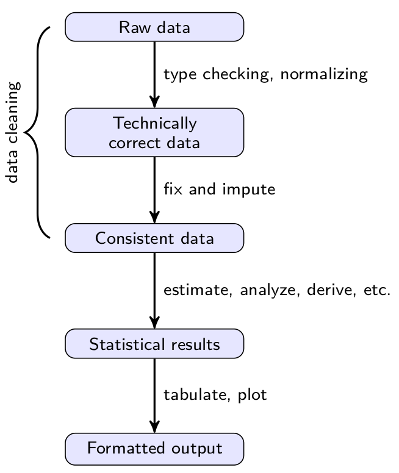

```{r setup, include=FALSE}
knitr::opts_chunk$set(echo = FALSE)
```

## Demos and other materials

\centering

[https://github.com/markvanderloo/satRday](https://github.com/markvanderloo/satRday)


## Contents


- The statistical value chain
- From raw data to technically correct data
    - Strings and encoding
    - Regexp and approximate matching
    - Type coercion
- From technically correct data to consistent data 
    - Data validation
    - Error localization
    - Correction, imputation, adjustment


# The statistical value chain

## Statistical value chain



## Concepts 

### Technically correct data

- Well-defined format (data structure)
- Well-defined types (numbers, date/time,string, categorical$...$ )
- Statistical units can be identified (persons, transactions, phone calls$...$)
- Variables can be identified as properties of statistical units.
- Note: tidy data $\subset$ technically correct data

### Consistent data

- Data satisfies demands from domain knowledge
  - (more on this when we talk about validation)


# From raw to technically correct data

## Dirty tabular data

### Demo

Coercing while reading: \texttt{/table}


## Tabular data: long story short

- `read.table`: R's swiss army knife
    - fairly strict (no sniffing)
    - Very flexible
    - Interface could be cleaner (see [this talk](http://sumsar.net/files/academia/UseR_2013_R_naming_conventions_final.pdf))
- `readr::read_csv`
    - Easy to switch between strict/lenient parsing
    - Compact control over column types
    - Fast
    - Clear reports of parsing failure


## Really dirty data

### Demo

Output file parsing: \texttt{/parsing}

## A few lessons from the demo


- (base) R has great text processing tools.
- Need to work with regular expressions\footnote{Mastering Regular Expressions (2006) by Jeffrey Friedl is a great resource}
- Write many small functions extracting single data elements.
- Don't overgeneralize: adapt functions as you meet new input.
- Smart use of existing tools (`read.table(text=)`)


## Packages for standard format parsing

- \pkg{jsonlite}: parse JSON files
- \pkg{yaml}: parse yaml files
- \pkg{xml2}: parse XML files
- \pkg{rvest}: scrape and parse HTML files


## Some tips on regular expressions with R

- `stringr` has _many_ useful shorthands for common tasks.
- Generate regular expressions with `rex`

```{r,echo=TRUE}
library(rex)
# recognize a number in scientific notation
rex(one_or_more(digit)
    , maybe(".",one_or_more(digit))
    , "E" %or% "e"
    , one_or_more(digit))
```

## Regular expressions

Express a _pattern_ of text, e.g.

$$
\texttt{"(a|b)c*"} = \{\texttt{"a"},\texttt{"ac"},\texttt{"acc"},\ldots,\texttt{"b"},\texttt{"bc"},\texttt{"bcc"},\ldots\}
$$
\begin{center}
\begin{tabular}{ll}
\textbf{Task}      & \textbf{\texttt{stringr}} function:\\
string detection   & \texttt{str\_detect(string, pattern)}\\
string extraction  & \texttt{str\_extract(string, pattern)}\\
string replacement & \texttt{str\_extract(string, pattern, replacement)}\\
string splitting   & \texttt{str\_split(string, pattern)}
\end{tabular}
\end{center}

\scriptsize
Base R: \texttt{grep grepl} | \texttt{regexpr regmatches} | \texttt{sub gsub}
| \texttt{strsplit}
\normalsize


## String normalization

Bring a text string in a standard format, e.g.

- Standardize upper/lower case (casefolding) 
    - \texttt{stringr}: \texttt{str\_to\_lower}, \texttt{str\_to\_upper}, \texttt{str\_to\_title}
    - \texttt{base R}: \texttt{tolower}, \texttt{toupper}
- Remove accents (transliteration)
    - \texttt{stringi}: \texttt{stri\_trans\_general}
    - \texttt{base R}: \texttt{iconv}
- Re-encoding
    - \texttt{stringi}: \texttt{stri\_encode}
    - \texttt{base R}: \texttt{iconv}
- Uniformize encoding (unicode normalization)
    - \texttt{stringi}: \texttt{stri\_trans\_nfkc} (and more)

## Encoding

\centering
\includegraphics[]{fig/face-screaming-in-fear.png}


## Encoding in R

\centering
\includegraphics{fig/encoding1.pdf}


## Encoding in R

\centering
\includegraphics{fig/Encoding2.pdf}

## Encoding in R

### Demo

Normalization, re-encoding, transliteration: \texttt{/strings}


## A few tips

\begin{tabular}{ll}
Detect encoding & \texttt{stringi::stri\_enc\_detect}\\
Conversion options & \texttt{iconvlist()} \texttt{stringi::stri\_enc\_list()}
\end{tabular}


## Approximate text matching

\centering
\includegraphics[angle=90,height=\textheight]{fig/string.pdf}

## Approximate text matching

### Demo

Approximate matching and normalization: \texttt{/matching}


## Approximate text matching: edit-based distances

\begin{center}
  \scriptsize
  \begin{tabular}{p{2cm}cccc}
      &\multicolumn{4}{c}{\textbf{Allowed operation}}\\
      \textbf{Distance}  & substitution & deletion & insertion & transposition\\
      Hamming            & \yep{}   & \nope{} & \nope{} &\nope{} \\
      LCS                & \nope{}  & \yep{}  & \yep{}  &\nope{} \\
      Levenshtein        & \yep{}   & \yep{}  & \yep{}  &\nope{} \\
      OSA                & \yep{}   & \yep{}  & \yep{}  &\yep{}$^*$ \\
      Damerau-Levenshtein& \yep{}   & \yep{}  & \yep{}  &\yep{}\\
    \end{tabular}\\
  \hfill{$^*$Substrings may be edited only once.}
\end{center}


$$\texttt{"leela"} \to \texttt{"leea"} \to \texttt{"leia"}$$

```{r,echo=TRUE}
stringdist::stringdist("leela","leia",method="dl")
```

## Some pointers for approximate matching

- Normalisation and approximate matching are complementary
- See [my useR2014 talk](http://www.slideshare.net/MarkVanDerLoo/stringdist-use-r2014) or [paper](http://www.markvanderloo.eu/files/statistics/loo.pdf) on stringdist for more distances
- The [fuzzyjoin](https://cran.r-project.org/package=fuzzyjoin) package allows fuzzy joining of datasets


## Other good stuff


- \texttt{lubridate}: extract dates from strings
    ```{r,echo=TRUE}
    lubridate::dmy("17 December 2015") 
    ```
- \texttt{tidyr}: many data cleaning operations to make your life easier
- \texttt{readr}: Parse numbers from text strings
    ```{r echo=TRUE}
    readr::parse_number(c("2%","6%","0.3%"))
    ```

# From technically correct to consistent data

## The mantra of data cleaning

- Detection (data conflicts with domain knowledge)
- Selection (find the value(s) that cause the violation)
- Correction (replace them with better values)


## Detection, AKA data validation

### Informally:

Data Validation is checking data against (multivariate) expectations about
a data set.


### Validation rules

Often these expectations can be expressed as a set of simple _validation rules_.


## Data validation

### Demo

The \pkg{validate} package \pkg{/validate}


## The \pkg{validate} package, in summary

- Make data validation rules explicit
- Treat them as objects of computation
    - store to / read from file
    - manipulate
    - annotate
- Confront data with rules
- Analyze/visualize the results


## Tracking changes when altering data

\centering
\includegraphics[]{fig/cell-changes.pdf}


## Tracking changes in rule violations

\centering
\includegraphics[]{fig/check-changes.pdf}


## Use rules to correct data

### Main idea

Rules restrict the data. Sometimes this is enough to derive a correct value uniquely.

### Examples

- Correct typos in values under linear restrictions
    - $123 + 45 \not= 177$, but $123 + \underline{54} = 177$. 
- Derive imputations from values under linear restrictions
    - $123 + \texttt{NA} = 177$, compute $177-123=54$.

Both can be generalized to systems $\mathbf{Ax}\leq\mathbf{b}$.
    
    
## Deductive correction and imputation


### Demo 

The \pkg{deductive} package: \texttt{/deductive}.


## Selection, or: error localization

### Fellegi and Holt (1976)

Find the least (weighted) number of fields that can be imputed
such that all rules can be satisfied.

### Note

- Solutions need not be unique.
- Random one chosen in case of degeneracy.
- Lowest weight need not guarantee smallest number of altered variables.


## Error localization

### Demo

The \pkg{errorlocate} package: \texttt{/errorlocate}


## Notes on \pkg{errorlocate}

- For in-record rules
- Support for
    - linear (in)equality rules 
    - Conditionals on categorical variables (if male then not pregnant)
    - Mixed conditionals (has job then age $>= 15$)
    - Conditionals w/linear predicates (staff $> 0$ then staff cost $> 0$)
- Optimization is mapped to MIP problem.


## Missing values

Mechanisms (Rubin):

- \textbf{MCAR}: missing completely at random
- \textbf{MAR}: $P(Y=\texttt{NA})$ depends on value of $X$
- \textbf{MNAR}: $P(Y=\texttt{NA})$ depends on value of $Y$


## Imputation

### Purpose of imputation vs prediction

- Prediction: estimate a single value (often for a single use)
- Imputation: estimate values such that the completed data set allows for
  valid inference\footnote{This is very difficult!}

### Imputation methods

- Deductive imputation
- Imputation based on predictive models
- Donor imputation (knn, pmm, sequential/random hot deck )


## Predictive model-based imputation

$$
\hat{y} = \hat{f}(\boldsymbol{x}) + \epsilon
$$
e.g.Linear regression
$$
\hat{y} = \alpha + \boldsymbol{x}^T\hat{\boldsymbol{\beta}} + \epsilon
$$

- Residual:
    - $\epsilon=0$ Impute expected value
    - $\epsilon$ drawn from observed residuals $e$
    - $\epsilon \sim N(0,\sigma)$ parametric residual, $\hat{\sigma}^2=\textrm{var}(e)$
- Multiple imputation (Bayesian bootstrap)
    - Draw $\boldsymbol{\beta}$ from parametric distribution, impute multiple times.


## Donor imputation (hot deck)

Method variants:

- \textbf{Random hot deck:} copy value from random record.
- \textbf{Sequential hot deck:} copy value from previous record.
- \textbf{$k$-nearest neighbours:} draw donor from $k$ neares neigbours
- \textbf{Predictive mean matching:} copy value closest to prediction

Donor pool variants:

- per variable
- per missing data pattern
- per record


## Note on multivariate donor imputation


Many multivariate methods seem relatively _ad hoc_, and more theoretical and
empirical comparisons with alternative approaches would be of interest.

\vfill{}

\small
Andridge and Little (2010) _A Review of Hot Deck Imputation for Survey Non-response_.
Int. Stat. Rev. \textbf{78}(1) 40–64


## Demo time

### Demo

Imputation \texttt{/imputation}

- \pkg{VIM}: visualisation, GUI, extensive methodology
- \pkg{simputation}: simple, scriptable interface to common methods


## Methods supported by \pkg{simputation}

- Model based (optionally add [non-]parametric random residual)
    - linear regression 
    - robust linear regression
    - CART models
    - Random forest
- Donor imputation (including various donor pool specifications)
    - k-nearest neigbour (based on [gower](https://cran.r-project.org/package=gower)'s distance)
    - sequential hotdeck (LOCF, NOCB)
    - random hotdeck
    - Predictive mean matching
- Other
    - (groupwise) median imputation (optional random residual)
    - Proxy imputation (copy from other variable) 


## Credits

\scriptsize{}
\begin{itemize}
\item \pkg{deductive} Mark van der Loo, Edwin de Jonge
\item \pkg{errorlocate} Edwin de Jonge, Mark van der Loo
\item \pkg{gower} Mark van der Loo
\item \pkg{jsonlite} Jeroen Ooms, Duncan Temple Lang, Lloyd Hilaiel
\item \pkg{magrittr} Stefan Milton Bache, Hadley Wickham
\item \pkg{rex} Kevin Ushey Jim Hester, Robert Krzyzanowski
\item \pkg{simputation} Mark van der Loo
\item \pkg{stringdist} Mark van der Loo, Jan van der Laan, R Core, Nick Logan
\item \pkg{stringi} Marek Gagolewski, Bartek Tartanus
\item \pkg{stringr} Hadley Wickham, RStudio
\item \pkg{tidyr} Hadley Wickham, RStudio
\item \pkg{validate} Mark van der Loo, Edwin de Jonge
\item \pkg{VIM} Matthias Templ, Andreas Alfons, Alexander Kowarik, Bernd Prantner
\item \pkg{xml2} Hadley Wickham, Jim Hester, Jeroen Ooms, RStudio, R foundation
\end{itemize}
\normalsize{}


